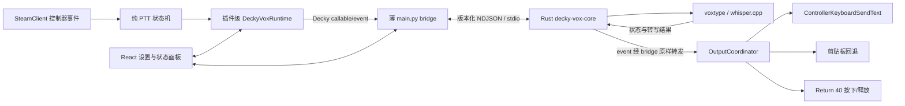

# Decky Vox v1 实施方案

> 状态：v0.1.0 实验实现已完成主机、Linux amd64 与 ZIP 自动验证；待真实 Steam Deck 验收。
> 日期：2026-08-11

## 1. 当前仓库基线

开始编写本方案前，`main` 分支只有模板初始提交 `a17b77c` 且无功能改动。仓库仍是基本未定制的 [Decky Plugin Template](https://github.com/SteamDeckHomebrew/decky-plugin-template)：

- `src/index.tsx` 只有加法与计时器示例。
- `main.py` 只有模板 Python RPC 与迁移示例。
- `backend/src/main.c` 只编译一个 `hello` 程序，与本项目无关。
- `plugin.json`、`package.json`、README、LICENSE 和 VS Code 配置仍含模板名称、作者和说明。
- `pnpm test` 当前固定失败；仓库没有测试框架和测试文件。
- 当前没有 `node_modules/`、`dist/`、`bin/`、`backend/out/`、`out/` 或 Decky CLI。
- 当前没有 `Cargo.toml`、`Cargo.lock`、Rust 后端源码或 Linux x86-64 Rust 产物。
- 模板规定前端产物为 `dist/index.js`；可安装 ZIP 必须包含 manifest、前端产物、Python 后端及许可证。原生二进制最终位于插件根目录的 `bin/`。

本机有 Node、Python、pnpm、Rust 和 Docker CLI，但模板要求 pnpm 9，而本机全局 pnpm 为 11。当前 Rust 是 `nightly-aarch64-apple-darwin`，只能用于主机侧测试，不能作为 Steam Deck 发布产物；Docker daemon 当前未启动。实现阶段会固定 pnpm 9、固定 stable Rust 版本，并在 Linux x86-64 Decky 构建容器中生成发布二进制。

Decky Loader 仍通过 `main.py` 暴露 Python callable/lifecycle，因此 v1 不删除 Python 入口；它只作为 Rust core 的薄适配层，不承载业务逻辑。

## 2. 简短实施计划

1. 去除模板示例，更新 Decky Vox 元数据、最低权限 flags、许可证和目录结构。
2. 建立 Cargo 工程与版本化 IPC，先实现并测试 Rust 设置归一化、服务状态和 voxtype 适配器。
3. 用 Rust core 完成模型、进程、录音、转写、session、状态和清理；Python 仅转发 Decky callable/event。
4. 实现插件生命周期级控制器监听、Steam 原生文字注入、剪贴板回退、显式自动发送和 React 设置面板。
5. 完成中文 README、第三方署名、可安装 ZIP 构建与 ZIP 内容检查。
6. 运行 TypeScript、Rust、薄 Python bridge、Linux ELF 和打包验证；将无法在开发机证明的项目列入真实 Steam Deck 验收清单。

## 3. v1 范围

### 实现

- 中文及多语言本地语音识别。
- 单键或双键组合的 hold/toggle PTT。
- 向当前焦点文本框注入识别文本。
- 正常路径不要求用户打开屏幕键盘或执行“粘贴”。
- 显式 opt-in 的自动 Enter。
- 原生注入异常时的剪贴板回退。
- 设置持久化、状态与错误提示。
- 首次显式下载模型，完成后离线录音和转写。

### 不实现

- 云端识别、API Key、联网文本处理。
- 好友列表、好友选择或自动打开会话。
- Steam 好友消息网络接口，包括 `ISteamFriends::ReplyToFriendMessage`。
- 坐标点击、OCR、自动寻找聊天框。
- 音乐、语音通话、游戏频道指令或 AI 文本润色。

## 4. 总体架构



边界如下：

- 控制器监听、PTT 状态机和输出协调器在 `definePlugin()` 生命周期创建，不挂在面板组件的可见生命周期上。关闭 Decky 面板后监听仍然存在；只有禁用插件或 `onDismount` 才清理。
- React 面板只展示状态、修改设置和显示风险，不拥有录音会话。
- Rust core 是设置、模型、录音/转写、session ownership、voxtype 子进程和业务状态的唯一事实来源。
- `main.py` 只负责 Decky lifecycle/callable、Rust 子进程监管、请求响应转发及把 Rust event 转为 `decky.emit`；它不保存第二份设置、不 trim 文本、不重试会话，也不判断是否自动发送。
- PTT 与 Steam UI 注入仍在 TypeScript，因为控制器回调和 `SteamClient.Input` 只存在于前端上下文；v1 不引入 Rust/WASM 前端。
- Steam 环境调用集中在窄适配器中；PTT 和输出决策保持纯逻辑，能在非 Steam Deck 主机上测试。
- v1 同一时间只允许一个录音/转写会话。

## 5. 建议目录结构

```text
src/
  index.tsx                       # definePlugin、常驻运行时与清理
  api/backend.ts                  # Decky callable/event 类型
  domain/settings.ts              # 前端设置类型与常量
  domain/pttMachine.ts            # 纯 PTT 状态机
  domain/outputPolicy.ts          # 纯输出/自动发送判定
  runtime/controllerInput.ts      # Steam 控制器适配器
  runtime/deckyVoxRuntime.ts       # 会话串行化与事件协调
  runtime/outputCoordinator.ts    # 注入、回退、Return 安全释放
  ui/DeckyVoxPanel.tsx            # 状态和设置面板
  steam-client.d.ts               # 最小 SteamClient 类型声明

backend/
  Cargo.toml
  Cargo.lock
  rust-toolchain.toml             # 固定 stable Rust，不跟随 host nightly
  Dockerfile                      # Decky Linux amd64 Rust toolchain
  Makefile                        # 输出 backend/out/decky-vox-core
  entrypoint.sh
  src/
    main.rs                       # NDJSON stdio 与 runtime 启动
    protocol.rs                   # 版本化 request/response/event
    settings.rs                   # 默认值、归一化、原子持久化
    service.rs                    # 单 actor 会话与业务状态
    engine.rs                     # Engine trait 与 voxtype adapter
    model.rs                      # 模型清单、下载、SHA 校验
    process.rs                    # 进程组、超时和清理
  tests/                          # Rust 集成测试与 fake engine

main.py                           # 极薄 Decky lifecycle/callable/emit bridge
tests/
  ts/                             # PTT 与输出策略测试
  python/                         # 只测试 bridge 和 fake Rust child
scripts/
  test-backend-linux.sh           # 同一 Linux amd64 镜像内运行 Rust 测试
  package.sh                      # 调用 Decky CLI 的唯一编排入口
  check_zip.py                    # ZIP 布局、声明和二进制检查
defaults/
  THIRD_PARTY_NOTICES.md
  licenses/                       # CLI 打包时移到 ZIP 根目录
```

模板的 C `hello` 后端会替换为自包含 Cargo crate。v1 的 Rust core 通过固定 argv 管理固定版 voxtype CPU/Vulkan Linux x86-64 二进制，不引入 whisper.cpp FFI，也不自行维护 whisper.cpp fork。

## 6. 设置与归一化

Rust core 保存的 `settings.json` 是持久化设置的事实来源，位置由 Python bridge 从 `decky.DECKY_PLUGIN_SETTINGS_DIR` 传入。Rust 负责 schema migration、路径校验、归一化和临时文件加原子替换；Python 不读取或改写设置。TypeScript 只保留 UI 类型及 fail-closed 显示默认值；Rust IPC 集成测试、Python fake-child 测试和 TypeScript 协议解析测试共同约束三端契约。

`Enable Decky Vox` 不持久化为 `enabled` 字段，而是本次 Decky 运行期间 Rust service 的 Start/Stop 命令；开机行为只由 `auto_start` 决定。

| 字段 | 默认值 | 归一化规则 |
| --- | --- | --- |
| `schema_version` | `1` | 未知版本先按已知字段迁移，不盲目保留旧值 |
| `model` | `small` | v1 白名单为 `tiny` / `base` / `small` / `medium` 多语言模型 |
| `language` | `auto` | v1 固定为自动检测，不开放云端或远程后端 |
| `gpu_enabled` | `true` | 严格布尔值；缺 Vulkan 二进制时可回退 CPU 并提示 |
| `ptt_mode` | `hold` | 仅 `hold` / `toggle` |
| `controller_primary` | `R4` | 仅允许 UI 给出的按键符号 |
| `controller_secondary` | `null` | 允许同一按键集或 `null`；与主键相同时归一化为 `null` |
| `output_mode` | `steam_input` | 仅三种模式；非法值安全回退到 `steam_input` |
| `send_delay_ms` | `250` | 整数并限制在 `100..5000` ms |
| `auto_start` | `true` | 严格布尔值 |

补充规则：

- 未知字段丢弃，缺失字段补默认值，错误类型不做隐式真值转换。
- 非法输出模式绝不能回退到 `steam_input_send`。
- 修改按键绑定时清空已按下集合，避免旧按键状态触发新绑定。
- 模型、语言和 GPU 选项在录音开始时冻结到本次会话；录音中修改只影响下一次。
- 自动发送采用更严格规则：会话开始时与输出发生时都必须是 `steam_input_send`。这样既不能在会话中途“升级”为自动发送，用户中途关闭自动发送也会立即阻止发送。
- `auto_start=true` 时，依赖和模型齐全后在插件加载时启动服务；`false` 时保持 Stopped，面板中的 `Enable Decky Vox` 开关显示关闭，用户打开后立即启动本次会话的服务。

## 7. PTT 状态机

状态机接收内部归一化事件 `{ controllerId, button, pressed }`；这不是对 Steam API 真实参数形状的假设。Steam 适配器负责把实机可用回调转换成该契约；接口缺失或 R4/R5 无法映射时进入明确的 capability Failed 状态。

状态机按控制器维护按下集合，避免两个不同控制器的按键拼成组合键。启动录音的控制器拥有本次 session，其他控制器在其结束前忽略；v1 不承诺复杂的多控制器协作。

### hold 模式

| 绑定 | 事件 | 动作 |
| --- | --- | --- |
| 单键 | 主键首次按下 | `START` |
| 单键 | 主键首次松开 | `STOP` |
| 组合键 | 从未满足到两个键均按下 | `START` |
| 组合键 | 录音中任一组合键松开 | `STOP` |

### toggle 模式

| 事件 | 动作 |
| --- | --- |
| 绑定从未满足到满足 | Ready 时 `START`；Recording 时 `STOP` |
| 任意键松开 | 只重新布防，不停止录音 |

这里对“组合键任一键松开即停止”的解释仅适用于默认 hold 模式；若 toggle 在松开时也停止，就无法满足“再次按下结束”的语义。该解释列在文末供评审。

去重与竞态规则：

- 已按下按键的重复 key-down、未按下按键的重复 key-up 均无动作。
- toggle 必须先完整离开激活态，下一次组合按下才能再次切换。
- Transcribing 阶段忽略新的开始请求。
- 运行时为会话生成单调递增 `session_id`；旧会话的迟到结果不得输出。
- START/STOP 通过带 `request_id` 与 `session_id` 的 bridge 请求发送；START ack 尚未返回就收到 STOP 时，Rust actor 仍必须按 START→STOP 串行处理，不能丢掉松开事件。
- bridge 超时、EOF、协议不匹配或 Rust core 退出时立即取消当前 session；重启后不得重放 START、STOP 或旧转写结果。
- 禁用、卸载或更换绑定会取消当前意图、清空按键状态，并 best-effort 停止录音。

## 8. 转写与输出安全策略

Rust core 只产生结构化结果，Python bridge 原样转为 Decky event，不 trim、不重试、不重新解释 `ok`：

```text
{ session_id, ok, text, error? }
```

正常 Rust event 的外层协议还携带 `protocol_version`、`instance_id`、`event_seq` 与消息 `kind`。前端用 `instance_id + event_seq + session_id` 拒绝旧 core、重复事件和迟到结果；Python/Rust 重启不能绕过 `outputConsumed` 门闩。

core EOF 或握手失败不是 Rust event：Python 通过独立 Decky event `decky_vox_bridge_status { bridge_instance, status, code }` 报告 `CORE_EXITED` / `PROTOCOL_MISMATCH` / `BACKEND_UNAVAILABLE`，不得伪造或延续 Rust 的 `instance_id/event_seq`。前端收到后立即作废当前 core instance、session 和待发送任务。

前端使用 `rawText.trim()` 作为实际输出文本。空串、全空白、失败结果或过期会话均直接结束，不调用原生注入、剪贴板或 Enter。

| 条件/模式 | 文字动作 | Enter | 结果状态 |
| --- | --- | --- | --- |
| 空转写或转写失败 | 无 | 无 | `No speech recognized` / `Failed` |
| `clipboard` | 仅复制 | 无 | `Copied to clipboard` 或 `Failed` |
| `steam_input` 且原生接口未抛异常 | `ControllerKeyboardSendText(text)` | 无 | `Input completed` |
| `steam_input_send` 且满足全部条件 | 原生注入 | 延迟后按下/释放 | `Sent` |
| SendText 缺失或抛异常 | 尝试剪贴板回退 | **无** | `Copied to clipboard` 或 `Failed` |
| SendText 成功，但 SetKeyState 缺失或失败 | 文本已可能注入，不再复制 | best-effort release | `Input completed; auto-send failed` |

自动发送必须同时满足：

```text
运行时服务仍启用
AND 会话仍是当前会话且未取消
AND 转写成功且 trim(text) 非空
AND 会话开始时 output_mode == steam_input_send
AND 当前 output_mode == steam_input_send
AND output_mode 已通过风险确认显式保存
AND ControllerKeyboardSendText 存在且调用未抛异常
AND ControllerKeyboardSetKeyState 存在
```

`output_mode=steam_input_send` 本身就是“用户已确认风险”的持久化结果，不另设可能漂移的确认字段。等待 `send_delay_ms` 结束、真正按 Return 前，会再次检查服务状态、session、取消 token 和当前 output mode。每个 session 还有一次性的 `outputConsumed` 门闩，重复 Decky event 不得二次注入。

Return 只由一个封装负责，键值固定为 `40`：

```ts
try {
  SteamClient.Input.ControllerKeyboardSetKeyState(40, true);
  await delay(30);
} finally {
  SteamClient.Input.ControllerKeyboardSetKeyState(40, false);
}
```

实现还会记录 Return 是否已按下；插件卸载、任务取消或异常时再次 best-effort release。若 SetKeyState 不存在或任一按键调用失败，不做剪贴板回退，以免已经注入的文字重复出现。`Sent` 只表示原生文本调用和 Return 调用未抛异常，不代表消息已通过网络送达。

剪贴板适配器依次尝试 Decky CEF 可用的复制路径并准确报告失败。剪贴板回退成功也绝不继续自动发送。

`ControllerKeyboardSendText` 返回 `void`，因此“没有异常”不能证明焦点聊天框实际收到中文。这一边界必须在 README 中写明，并依靠真实 Steam Deck 测试。

## 9. Rust core、Python bridge 与 voxtype

优先选择性复用 [mimed95/decky-voxtype](https://github.com/mimed95/decky-voxtype) 的已验证思路：插件级控制器监听、voxtype daemon 生命周期、状态跟踪、SteamOS 环境变量修复和二进制打包。审计参考版本为提交 `cbb2201dcad36cf5291ec360c9fb1183fe9071be`；不会整仓复制，也不会继承其仅剪贴板/toggle 的行为。

### Rust core

`bin/decky-vox-core` 是随插件生命周期运行的 Rust sidecar，本身不 daemonize。内部用单 actor 串行拥有设置、phase、当前 session、模型任务和 Engine，保证快速 START→STOP、取消与迟到结果按确定顺序处理。

Rust 负责：

- 设置 schema、归一化、原子持久化与路径安全。
- 固定模型清单、空间检查、流式下载、SHA-256 和原子安装。
- voxtype/whisper 进程、录音/转写状态机、超时、唯一 session 结果文件和临时文件清理。
- 结构化状态/event/error；稳定 Rust 错误码包括 `MODEL_MISSING`、`ENGINE_START_FAILED`、`MICROPHONE_UNAVAILABLE`、`BUSY` 与 `INVALID_SETTINGS`。
- 整个子进程组的终止；stdin EOF、shutdown 或 parent death 时清理 voxtype、状态跟踪器和临时音频，不能留下孤儿进程。

### 薄 Python bridge

`main.py` 在 `_main` 中用固定绝对路径和 `asyncio.create_subprocess_exec` 启动 Rust core，并把 Decky plugin/settings/runtime/log 路径作为受控参数或环境传入。它维护一个 writer lock、递增 request ID、pending future 表、stdout reader 和 stderr log reader。

- callable 只映射到同名 IPC request；Rust response 原样返回。
- Rust event 原样转成 `decky.emit`；Python 不保存业务状态、不 trim 文本、不做安全策略。
- core EOF/异常退出或协议不匹配时，所有 pending RPC 立即失败；Python 只发送独立 `decky_vox_bridge_status` 使前端作废当前 instance/session，不伪造 Rust event。v1 不自动重启或重放任何请求，用户通过重新加载插件恢复。
- `_unload` 先发送 `shutdown` 并等待约 2–3 秒，随后对整个进程组依次 terminate/kill。
- bridge 恢复 Decky/PyInstaller 泄漏的宿主 `LD_LIBRARY_PATH`，并为 core/voxtype 设置正确的 `XDG_RUNTIME_DIR`。

### 版本化 IPC

IPC 使用 stdin/stdout NDJSON，避免额外 socket、端口和权限状态。Rust stdout **只能**输出协议并逐行 flush；日志、panic hook 和子进程输出只能进入 stderr 或日志文件。每行设大小上限，畸形 JSON、未知 method 或版本不匹配均 fail closed。

单一 Rust actor 按顺序写 response/event，并在每行后 flush；只有这一处拥有 stdout，避免并发写入破坏 NDJSON 帧。模型下载和 Engine 通过内部 channel 把事件交回 actor，工作线程不能直接写协议输出。

```text
request  { v, kind:"request", id, method, params }
response { v, kind:"response", id, ok, result | error }
event    { v, kind:"event", instance_id, seq, name, payload }
```

启动时必须先完成 `hello` 协议/能力握手，再取得 `get_snapshot`。主要请求为 `get_snapshot`、`update_settings`、`set_enabled`、`record_start(session_id)`、`record_stop(session_id)`、`cancel_session`、`install_model`、`cancel_model` 与 `shutdown`。录音请求只确认状态转换；耗时转写通过 event 返回，避免把长任务绑在 RPC timeout 上。

### voxtype 适配器

- v1 不做 whisper.cpp FFI；Rust 通过 Engine trait 和固定 argv 管理外部 voxtype，方便 fake engine 测试和将来替换实现。
- 初始候选为 decky-voxtype 已使用的 voxtype `v0.6.5` CPU/Vulkan 版本，不跟随 latest。接入前验证外部 start/stop、纯文件结果、彻底关闭内置输出、`small` + `auto`、两种产物和 SteamOS 依赖；不满足时才改用固定 whisper.cpp CLI adapter。
- `package.json.remote_binary` 声明两个 Linux x86-64 URL 和 SHA-256，由 Decky CLI 下载、校验并放入 ZIP。
- 使用插件隔离的 config/XDG 目录、`--no-hotkey`、`--quiet`、文件输出和每 session 唯一结果文件，关闭 voxtype 自带热键、剪贴板、键盘注入、音频反馈及自动提交。清除继承来的 `VOXTYPE_*`/`RUST_LOG` 覆盖，防止宿主环境改变引擎、远端端点、输出或日志级别；所有文字输出只能经过前端 `OutputCoordinator`。
- 会话目录权限为 `0700`，结果读取后删除，core 启动时清理同一实例运行目录的异常遗留；持久日志不得记录成功转写正文。
- GPU 开启时选择 Vulkan 二进制；失败时回退 CPU 并报告实际后端，不篡改 `gpu_enabled`，也不改用云端。
- 模型仅允许带固定 HTTPS 来源、许可证和 SHA-256 的 `tiny` / `base` / `small` / `medium` 多语言版本。下载使用 `.part`、空间检查、校验和原子安装；取消或失败清理残留，不自动换模型。默认 `small`，安装后日常识别完全离线。
- 子进程一律使用绝对路径和固定 argv，不使用 shell；非配置化最大录音时长防止 release 丢失后无限录音。

## 10. UI 与状态

面板顶部始终显示：**开始录音前，请先让目标聊天输入框获得焦点。** v1 不会自动寻找或点击聊天框。

设置项：

- Enable Decky Vox
- Model
- Vulkan GPU acceleration
- PTT mode
- Primary button
- Optional chord button
- Output mode
- Auto-send delay
- Auto-start on boot

`Enable Decky Vox` 显示本次运行时服务状态：打开后向 Rust 发送 `set_enabled`，只有 Rust ack 并进入 backend ready 才算后端启动成功；关闭会取消 session 并停止 Engine。它本身不写入设置文件。`auto_start` 决定 core 启动后是否自动启用。缺二进制或模型时显示 Setup required；模型完成安装后，`auto_start=true` 才自动启动 backend，否则保持 Stopped。

选择 `steam_input_send` 时必须经过明确风险确认，旁边持续显示“焦点错误可能把内容发送到非预期位置”的警告；取消确认则保持 `steam_input`。

运行阶段与最近结果分开存储，避免 `Sent` 阻止下一次录音：

```text
Stopped → Ready → Recording → Transcribing → Ready
```

Rust 只拥有 backend phase：`stopped | setup_required | ready | recording | transcribing | failed`。TypeScript 另行维护 controller capability；用户可见 Ready = `backend phase == ready` 且控制器监听可用。Rust 不感知前端 controller adapter，Python 也不合成 Ready。`Input completed`、`Sent` 和 `Copied to clipboard` 只能由 TypeScript 输出层产生。

用户可见 Ready 表示 IPC 握手、前端控制器 capability、Rust core、运行二进制、所选模型和 voxtype daemon 已准备。麦克风只能在每次实际开始录音时验证；`record_start` 必须等待 daemon 确认进入录音状态，失败或超时则报告 `MICROPHONE_UNAVAILABLE`，不能伪报 Recording。UI 还要区分 Backend unavailable、Protocol mismatch 与 Core crashed。

`last_outcome` 为：

- Input completed
- Input completed; auto-send failed
- Sent
- Copied to clipboard
- No speech recognized
- Failed

## 11. 许可证与上游署名

项目继续采用 BSD-3-Clause。实施时：

- 替换当前 `Hypothetical Plugin Developer` 占位版权信息，同时保留 Steam Deck Homebrew 模板许可。
- 若复用/改写 decky-voxtype 代码，保留 mimed95 的完整 BSD-3-Clause 文本、版权声明，并在派生文件注释、README 和 `THIRD_PARTY_NOTICES` 中列出来源与复用范围。
- 即使把上游 Python 逻辑翻译成 Rust，只要属于派生复用，仍保留其 BSD-3-Clause 署名；换语言不消除许可证义务。
- 随 ZIP 附带 voxtype 的 MIT 许可证；同时列出 whisper.cpp 与模型的许可证、固定版本和校验信息。
- 提交 `Cargo.lock`，对 Rust crates 做许可证审计，并从锁文件生成/核对第三方清单。
- README 明确感谢 Decky Loader、mimed95/decky-voxtype、peteonrails/voxtype 与 whisper.cpp。

## 12. 构建与 ZIP

元数据目标如下：

- `package.json.name`: `decky-vox`
- `packageManager`: 固定 pnpm 9
- 仓库 URL：`https://github.com/marsevilspirit/decky-vox`
- `plugin.json.name`: `Decky Vox`
- `api_version`: `1`
- 版本与许可证：语义版本、BSD-3-Clause
- 作者/版权信息使用仓库所有者确认后的值，清除全部模板占位内容
- `plugin.json.publish.description` 使用下列完整英文描述

权限目标是 `flags: []`，并先在实机验证 deck 用户对麦克风、PipeWire、模型目录和子进程的访问。只有出现可复现的权限阻塞且没有更窄方案时，才重新评估 `_root`；模板的 `debug` 不进入发布包。

Description：

> Offline push-to-talk voice typing for Steam Deck with native text input and optional auto-send.

唯一 ZIP 写入者为 Decky CLI；`scripts/package.sh` 先调用 `scripts/test-backend-linux.sh` 在同一 Linux amd64 toolchain 镜像中运行 Rust tests，再以固定参数调用 CLI，最后检查产物，不能自行 stage/re-zip。CLI 必须使用目录名作为文件名来源，避免显示名称 `Decky Vox` 带来的空格：

```bash
./cli/decky plugin build . --output-path ./out --tmp-output-path /tmp/decky-vox-build --output-filename-source directory
```

canonical 流程为：

1. Decky CLI 构建 TypeScript，生成 `dist/index.js`。
2. CLI 用固定 digest 的 `holo-toolchain-rust` Linux amd64 容器构建 `backend/`。
3. 容器使用固定 stable Rust、`x86_64-unknown-linux-gnu` 和 `cargo build --release --locked`，再把 `decky-vox-core` 以 `0755` 安装到 `/backend/out`；禁止 `target-cpu=native`，也绝不使用开发 Mac 的 Mach-O。
4. CLI 根据 `package.json.remote_binary_bundling=true` 和 `remote_binary` URL/SHA 下载两个 voxtype 产物，与 Rust core 一起进入 ZIP 的 `bin/`。
5. CLI 打包固定根文件、`dist/`、`bin/` 与 `defaults/`；`defaults/` 前缀在 ZIP 中被剥离，因此第三方 notices/licenses 放在该目录。

Rust core 从源码构建；只有第三方 voxtype 使用固定预编译二进制。ZIP 是否真正可安装仍以真实 Steam Deck sideload 为最终验收。

该流程以 Decky CLI 当前的 [backend staging](https://github.com/SteamDeckHomebrew/cli/blob/main/src/cli/plugin/build.rs#L1265-L1351)、[remote binary bundling](https://github.com/SteamDeckHomebrew/cli/blob/main/src/cli/plugin/build.rs#L1355-L1466) 和 [ZIP allowlist](https://github.com/SteamDeckHomebrew/cli/blob/main/src/cli/plugin/build.rs#L1608-L1795) 为依据；实现时固定并记录实际使用的 CLI 版本。

ZIP 使用单一顶层目录 `decky-vox/`，至少包含：

```text
decky-vox/
  dist/index.js
  bin/decky-vox-core
  bin/voxtype
  bin/voxtype-vulkan
  main.py
  package.json
  plugin.json
  README.md
  LICENSE
  THIRD_PARTY_NOTICES.md
  licenses/*
```

检查脚本验证：

- 只有一个正确的顶层目录。
- Rust core 与两个 `package.json.remote_binary` 产物均存在，voxtype 名称、URL、SHA-256 一一对应。
- 三个二进制具有 executable 位，均为 ELF64 x86-64（`e_machine == 62`），不是 Mach-O/aarch64；Linux 构建环境用 `readelf`/`ldd` 检查 ABI、CPU 与动态依赖。通用工具链镜像只允许 SteamOS 运行时提供的 `libasound.so.2`，以及 Vulkan 产物的 `libvulkan.so.1` 未解析；任何其他 `not found` 都失败，这两项仍列入实机验收。
- `main.py` 与 Rust core 的协议版本通过握手集成测试一致。
- `dist/index.js` 存在。
- ZIP 不包含 `target/`、增量产物、测试、缓存、临时音频、开发依赖或模型下载残留。

默认 `small` 模型不塞进安装 ZIP，以避免把 ZIP 扩大数百 MB；首次下载需要网络，但识别过程不联网。README 会明确区分“首次模型准备”和“日常完全离线转写”。

README 至少提供中文的安装、首次模型准备、使用流程、自动发送与焦点误发风险、故障排查、上游署名、许可证说明和真实 Steam Deck 验收边界；还要明确正常流程无需屏幕键盘/点击粘贴，以及 Steam API 返回 `void` 的硬件测试边界。

## 13. 自动化验证

### 测试矩阵

| 范围 | 必测行为 |
| --- | --- |
| Rust 设置归一化 | 缺字段、错误类型、非法枚举、未知字段、延迟边界、重复组合键、安全输出默认值、原子写 |
| hold 单键 | 首次 down 启动、重复 down 无动作、首次 up 停止、重复 up 无动作 |
| hold 组合键 | 单键不足不启动、组合完成只启动一次、任一键松开只停止一次 |
| toggle | 完成组合只切换一次、释放只重新布防、重复事件无动作 |
| 会话竞态 | 快速按住/松开、旧 session 返回、禁用/卸载后结果均不输出 |
| 空/失败转写 | 不注入、不复制、不按 Enter |
| `steam_input` | 只注入文本，不调用 Return |
| `steam_input_send` | 先注入、等待配置值、Return 40 pressed、约 30 ms、released |
| SendText 异常 | 尝试剪贴板；回退失败能报告；Return 调用次数为 0 |
| SetKeyState 异常 | SendText 成功后不复制；pressed/released 任一步异常仍 best-effort release |
| 延迟取消 | 250 ms 期间禁用、切换模式、换 session 或卸载均不按 Enter |
| 重复结果 | 同一 session 只消费和输出一次 |
| 启动策略 | `auto_start=true/false` 与运行时 Enable 的所有路径可操作且状态一致 |
| 多控制器 | session owner 之外的控制器不能启动或停止当前会话 |
| Rust service | fake Engine 下 start/stop 幂等、快速 release、busy、取消、迟到/空结果、进程组清理、argv 无 shell |
| IPC | hello、版本不匹配、畸形/超大消息、request mux、instance/seq、EOF、stdout 无日志污染 |
| Python bridge | fake child 的握手、并发响应、event relay、timeout、core crash、unload shutdown/强杀；不含业务判断 |
| 模型安装 | 空间不足、中断和 SHA 错误不留下可误认成有效模型的文件 |
| ZIP | 布局、manifest、运行模块、二进制声明、哈希、权限、目标架构和动态依赖闭包 |

### 拟定命令

```bash
corepack pnpm install --frozen-lockfile
corepack pnpm test
corepack pnpm run build
corepack pnpm exec tsc --noEmit
# 以下三条从 backend/ 目录运行，以读取 backend/rust-toolchain.toml
cargo fmt --all -- --check
cargo clippy --all-targets --all-features --locked -- -D warnings
cargo test --all-targets --locked
# 以下命令回到仓库根目录运行
python3 -m unittest discover -s tests/python -p 'test_*.py'
python3 -m py_compile main.py
scripts/test-backend-linux.sh
scripts/package.sh
python3 scripts/check_zip.py out/decky-vox.zip
```

TypeScript 测试采用轻量测试运行器；Rust 测试使用 fake Engine，不依赖麦克风或模型；Python 测试只依赖标准库和 fake child，不直接依赖真实 `decky`。macOS Rust 测试只证明纯逻辑，最终 release/test 还必须在 Decky Linux amd64 容器中以 `--locked` 执行。

## 14. 真实 Steam Deck 验收边界

以下项目无法由 macOS 开发机或单元测试证明，README 和发布验收清单必须逐项列出：

- R4/R5 输入事件、组合键和事件重复行为。
- 内置麦克风设备、权限和长时间录音稳定性。
- Vulkan 模型加载、性能、CPU 回退及热/内存表现。
- Steam 好友聊天当前焦点框的中文原生注入。
- 约 250 ms 延迟后的自动 Enter，以及 Return 不会卡住。
- SteamOS、Steam 客户端和 Decky Loader 更新后的兼容性。

另需实机确认：面板关闭后的监听、游戏 Steam Input 映射是否吞掉 R4/R5，以及剪贴板回退在 Decky CEF 后台上下文中的可用性。

Rust/bridge 还需实机确认：

- Decky 用户能启动 Rust core，且 Linux ABI、CPU 指令与动态库兼容。
- 两个 voxtype 产物在原生 x86_64 Steam Deck 上能执行完整 CLI/daemon/record/status 路径；arm64 开发机的 amd64 Docker 仿真只能证明 ELF、依赖声明和 `--version`，不能代替该烟测。
- Decky reload 后能重新握手，protocol mismatch 能 fail closed。
- core crash、Python/Decky 退出或插件卸载后没有 core/voxtype/录音孤儿进程。
- core crash 后旧 session 不会迟到注入文字或触发 Enter。
- Vulkan voxtype 在 SteamOS 上能够实际加载；macOS 或容器中的 ELF 检查不能代替该验证。

## 15. 评审时请重点确认的假设

1. **模型分发**：默认采用“首次显式下载 `small`，之后完全离线”，不把模型塞入 ZIP。
2. **语言边界**：业务后端使用 Rust；TypeScript 保留 Decky 前端能力，Python 只保留 Loader 必需的薄 bridge，不采用 Rust/WASM 前端或 PyO3。
3. **Rust 产物**：core 从源码以固定 stable Rust 和 `x86_64-unknown-linux-gnu` 构建；不下载预编译 core、不用 host nightly、不用 `target-cpu=native`。
4. **IPC**：v1 使用版本化 stdio NDJSON，不引入 UDS/gRPC；core crash 后不自动重启或重放会话。
5. **ASR 接入**：Rust v1 通过 Engine adapter 调用外部 voxtype，不做 whisper.cpp FFI。先以 voxtype `v0.6.5` 为候选，能力/依赖检查失败才改用 whisper.cpp CLI。
6. **打包入口**：Decky CLI 是唯一 ZIP 写入者；项目脚本只负责编排 CLI 和验证产物。
7. **toggle 组合键语义**：toggle 模式松键只重新布防；“任意组合键松开即停止”仅用于 hold 模式。
8. **成功措辞**：`Input completed` / `Sent` 只表示 Steam API 调用未抛异常，不宣称焦点框或网络消息已确认收到。
